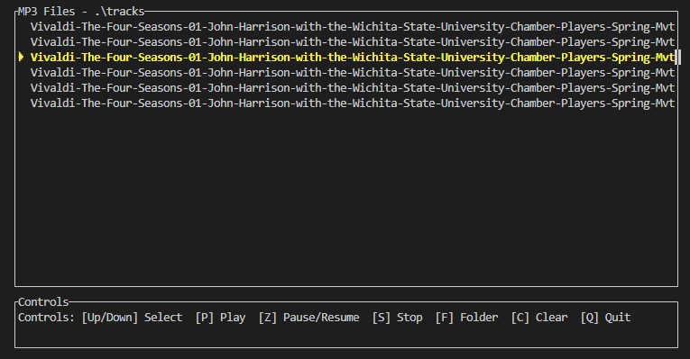

TUI based media player for windows and *nix OS. 

TODO: 
- add all main formats
- add stream play
- add support playlists
- nice tui interface, probably visualizer

  

Usage:

Controls:

 [Up/Down] Select 
 [P] Play 
 [Z] Pause/Resume  
 [S] Stop  
 [F] Folder  
 [C] Clear  
 [Q] Quit 