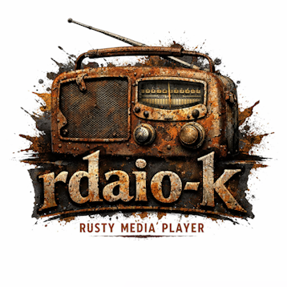
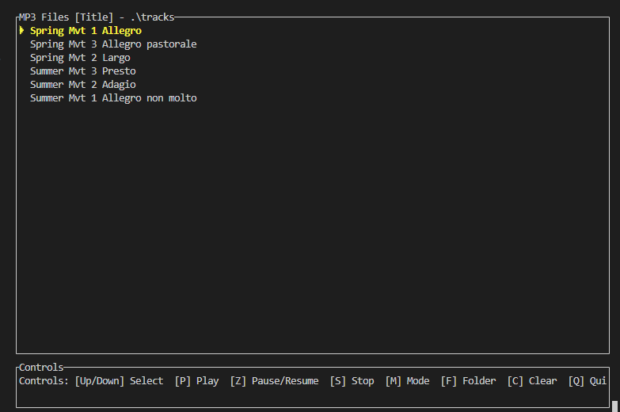

#### RDAIO-L

### TUI based media player for windows and *nix OS. 

Main idea create modern, console-friendly media player for using in terminal 
It should be simple but support most of common features for popular media-players

###### Usage:

##### Controls:

 [Up/Down]  Select track

 [Enter]   Load directory (in folder browser)

 [L]       Load directory contents

 [P]       Play selected track

 [Z]       Pause/Resume

 [S]       Stop playback

 [M]       Toggle display mode (title vs filename)

 [PageUp]  Play previous track

 [PageDown] Play next track

 [H]       Shuffle queue

 [O]       Restore original order

 [F]       Folder browser (DOS-like selector)

 [C]       Clear queue

 [Q]       Quit application

 [ESC]     Exit folder browser 

##### Features:

- **Streaming MP3 playback** - Instant startup, memory efficient
- **ID3 metadata** - Display song titles from MP3 tags
- **Folder navigation** - DOS-style browser for selecting directories
- **Queue persistence** - Saves/restores your current playlist
- **Auto-play** - Automatically plays next track in queue
- **Display modes** - Toggle between ID3 titles and filenames
- **Debug mode** - Run with `--debug` flag for detailed logging

##### Display Modes:

Title mode (ID3 based):

Filename mode:

##### Future Enhancements:
- Support for additional audio formats (FLAC, WAV, OGG)
- Playlist file support (.m3u, .pls)
- Equalizer and audio effects
- Shuffle and repeat modes
- Waveform visualizer

##### License:

This project is licensed under the **MIT License**. See [LICENSE](LICENSE) for details.

Third-party dependencies are licensed under compatible licenses (Apache-2.0, MPL-2.0). 
It includes Symphonia (MPL-2.0);
See [THIRD_PARTY_NOTICES.md](THIRD_PARTY_NOTICES.md) and the [licenses/](licenses/) directory for details.
